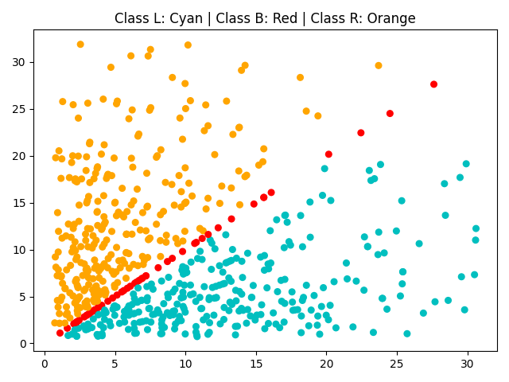

## EX1
  In this project we have a 4 dimentioanal Data-Set, and we want to classify adn visualize it, since it has 4 dimentions, it is hard to do that, so I came up with another solution.
  I extracted some fearues out of this data-set, so that if we use them we'll have two features that classifies this data-set very well.
  The features that I used were to multiplying `Left-Distance` to `Left-Weight` together and 
  `Right-Distance` to `Right-Weight` together.
  The result is as follows :
  
  
