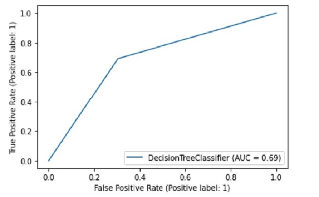
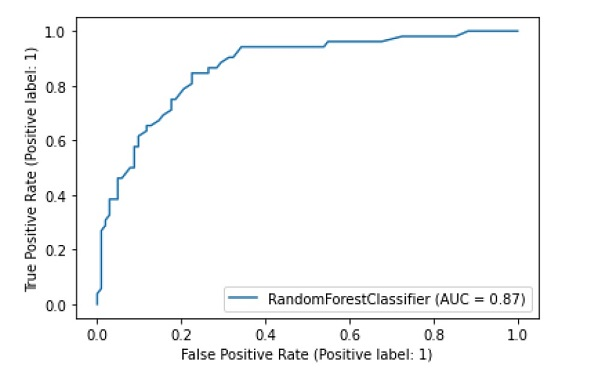

### Random Forest & Desicion Tree
In this mini project I tried to classify some patients in order to figure out if they have Diabetes or not.
Features used in here were some health related feature like Age, BMI, Glucose level, etc.
I used two different algorithms one single classifier (Desicion Tree) and one ensemble classifier (Random Forest), both based on Desicion Trees.
- Desicion Tree: Acc on confusion matrix is about 65% and ROC Curve is shown below:

  

- Random Forest: Acc on confusion matrix is about 80% and ROC Curve is shown below:

  
